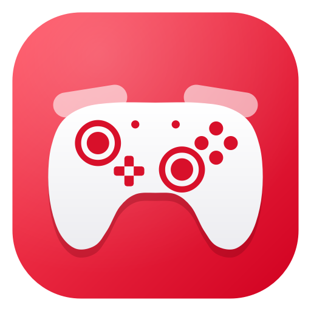
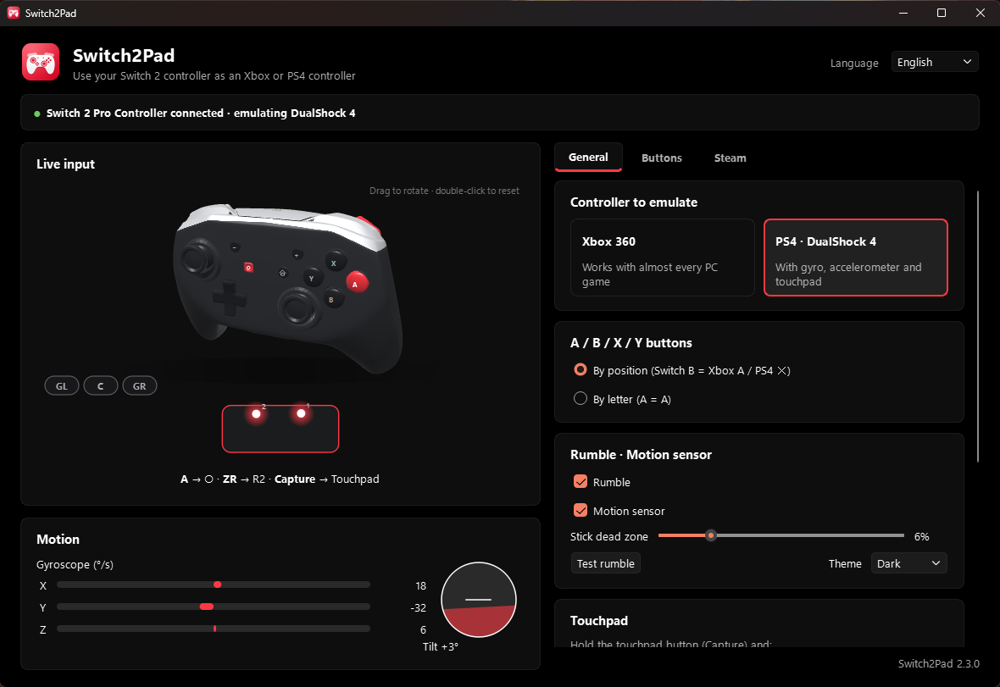
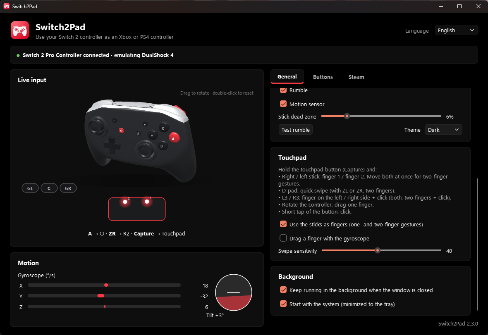
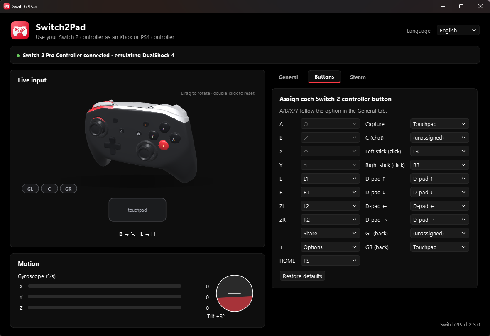
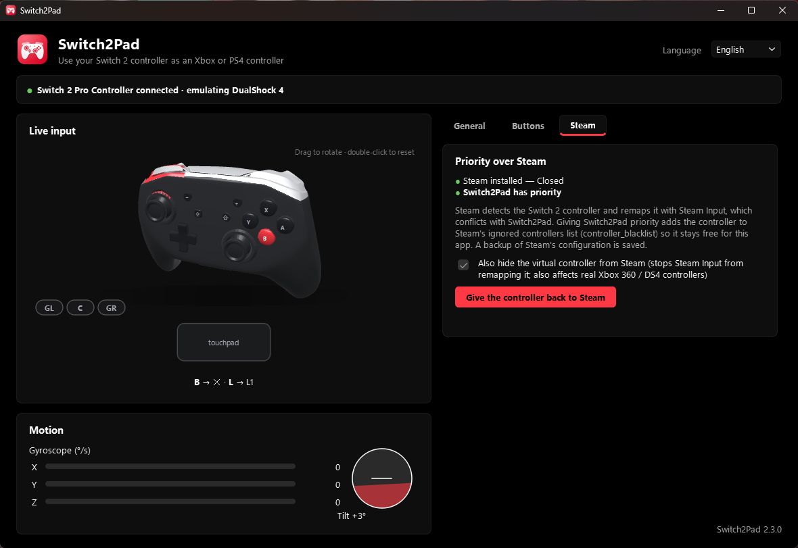
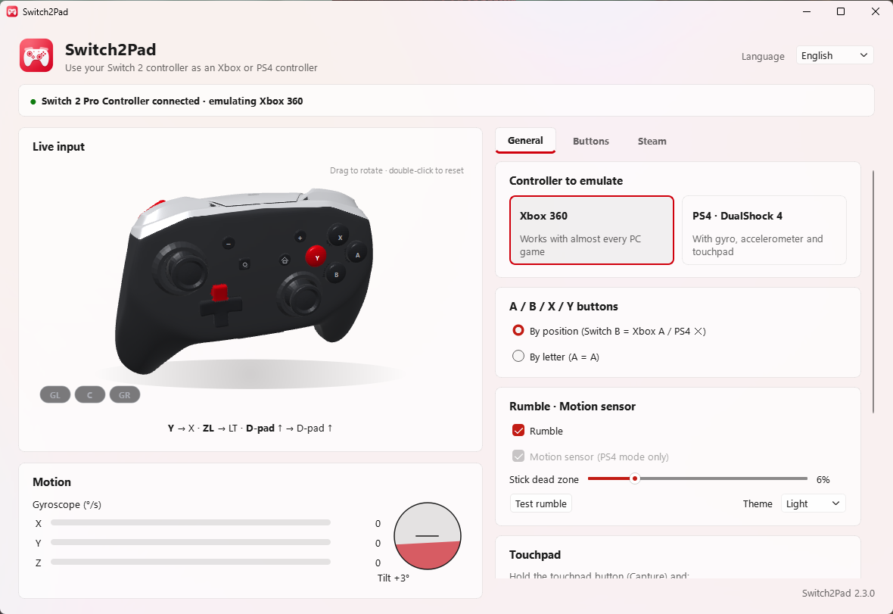
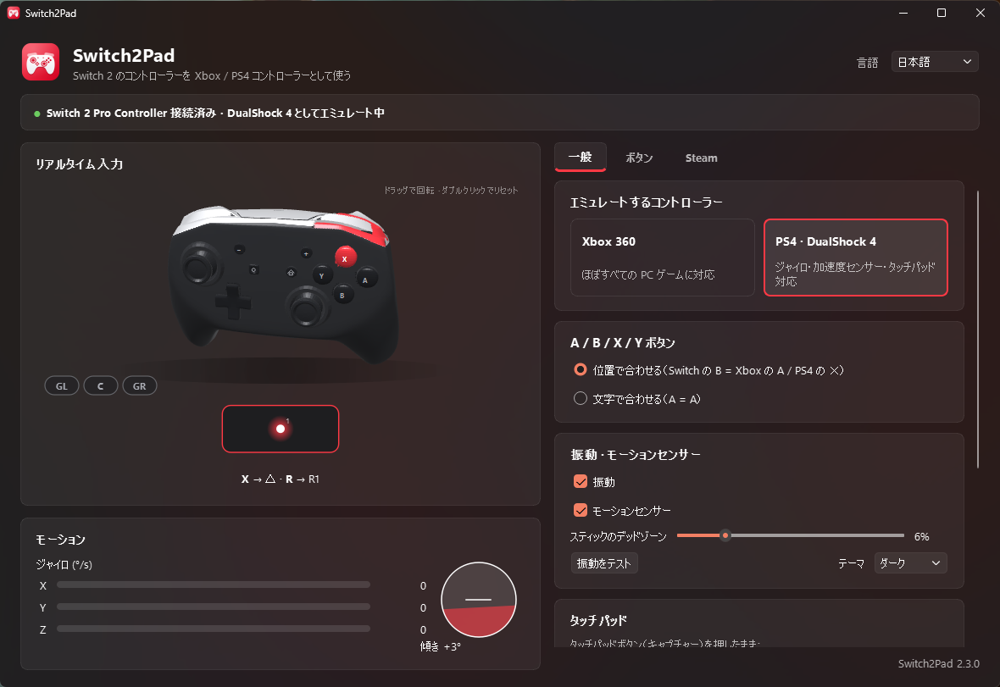
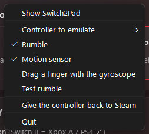

<div align="center">



# Switch2Pad

**Use your Nintendo Switch 2 Pro Controller on PC as an Xbox 360 or DualShock 4 controller — with gyro, touchpad gestures and rumble.**

[](https://github.com/TomGGB/Switch2Pad/releases/latest)
[](https://github.com/TomGGB/Switch2Pad/releases)


[](https://github.com/TomGGB/Switch2Pad/stargazers)

**English** · [Español](docs/README.es.md) · [Português](docs/README.pt-BR.md) · [Français](docs/README.fr.md) · [Deutsch](docs/README.de.md) · [Italiano](docs/README.it.md) · [日本語](docs/README.ja.md) · [简体中文](docs/README.zh-CN.md)



</div>

## Why Switch2Pad?

Windows and most games don't understand the Switch 2 Pro Controller over USB: it doesn't even send input until it receives a special initialization sequence. Switch2Pad talks to the controller directly and turns it into a **virtual Xbox 360 or DualShock 4** that every game, emulator and launcher already supports.

- 🎮 **Xbox 360 or PS4 mode** — switch at any time, even while playing.
- 🌀 **Gyro & accelerometer** (PS4 mode) — motion aiming in games and emulators that support DS4 motion.
- ✌️ **Touchpad gestures, including two fingers** — hold *Capture* and the sticks become fingers; D-pad for quick swipes; L3/R3 to click the left/right side of the pad.
- 📳 **Rumble** forwarded from the game to the controller.
- 🧊 **Live 3D controller** that follows the real controller's gyro and lights up the buttons you press.
- 🚫 **Priority over Steam** — one click stops Steam from grabbing and remapping the controller.
- 🔧 **Remap every button**, A/B/X/Y by position or by letter, stick dead zone.
- 🪟 **Native Windows 11 look** (Mica, light/dark, accent color), system tray and start with Windows.
- 🌍 **7 languages**: English, Español, Português, Français, Deutsch, Italiano, 日本語.
- 🐧 **Windows and Linux**.

## Download

| Platform | File | Notes |
|---|---|---|
| **Windows 10/11** | [`Switch2Pad.exe`](https://github.com/TomGGB/Switch2Pad/releases/latest) | No installation. If [ViGEmBus](https://github.com/nefarius/ViGEmBus/releases) is missing, the app offers to install it. |
| **Linux x86_64** | [`Switch2Pad-<version>-linux-x86_64.tar.gz`](https://github.com/TomGGB/Switch2Pad/releases/latest) | Extract and run `./install.sh` (adds a menu entry and the udev rules). |

## Quick start

1. Plug the Switch 2 Pro Controller in with a **USB-C cable**.
2. Open Switch2Pad and pick **Xbox 360** or **PS4 · DualShock 4**.
3. Play. Closing the window keeps it running in the system tray.

> **Using Steam?** Open the *Steam* tab and click **Give Switch2Pad priority** so Steam stops taking over the controller (Steam restarts by itself; a backup of its config is kept).

## Screenshots

| Touchpad gestures & background options | Button remapping |
|---|---|
|  |  |
| **Priority over Steam** | **Light theme · Xbox mode** |
|  |  |
| **Translated UI (日本語)** | **System tray** |
|  |  |

## Touchpad gestures (PS4 mode)

Hold the button assigned to the touchpad (**Capture** by default) and:

| Input | Touchpad action |
|---|---|
| Right / left stick | Finger 1 / finger 2 — move both for **two-finger gestures** (e.g. "MOVE CAR" in *inFAMOUS Second Son*) |
| D-pad | Quick swipe in that direction (hold ZL or ZR for a two-finger swipe) |
| L3 / R3 | Finger on the left / right side **+ click** (both = two fingers + click) |
| Rotate the controller | Drag one finger with the gyro (optional) |
| Short tap of the button | Click |

While the touchpad button is held, the sticks and D-pad are not sent to the game.

## FAQ

<details><summary><b>Does it work with Bluetooth?</b></summary>
Not yet — USB only.
</details>

<details><summary><b>Which mode should I use, Xbox or PS4?</b></summary>
Xbox 360 works with almost every PC game. Use PS4 when you want gyro/motion or the touchpad (PS4 emulators such as shadPS4, games with DS4 support, Steam).
</details>

<details><summary><b>A game sees two controllers.</b></summary>
Hide the physical controller with <a href="https://github.com/nefarius/HidHide">HidHide</a>, or enable <i>priority over Steam</i> if the second one comes from Steam Input.
</details>

<details><summary><b>Does it need admin rights?</b></summary>
It runs as a normal user. Only installing ViGEmBus (Windows) or the udev rules (Linux) asks for admin rights, once.
</details>

<details><summary><b>Which controllers are supported?</b></summary>
Switch 2 Pro Controller (tested). NSO GameCube controller: experimental. Joy-Con 2: not yet.
</details>

## Build from source

```sh
pip install -r requirements.txt pyinstaller
python -m PyInstaller switch2pad.spec      # Windows -> dist/Switch2Pad.exe
sh build_linux.sh                           # Linux   -> dist/Switch2Pad-<version>-linux-x86_64.tar.gz
```

Run without building: `python -m switch2pad` (or `--cli` for a console-only mode, `--minimized` to start in the tray).
Settings are stored in `%APPDATA%\Switch2Pad\config.json` (Windows) or `~/.config/switch2pad/config.json` (Linux).

## How it works

The controller is initialized over its USB bulk interface (protocol based on SDL's
`SDL_hidapi_switch2.c`), input reports are read from the HID interface and translated to a
virtual controller: **ViGEmBus** on Windows, **uinput** on Linux (devices identical to the
kernel's `xpad` / `hid-playstation`, so SDL, Steam and Proton recognize them). The 3D view is
rendered with OpenGL (`assets/pro_controller.npz`, generated by `tools/convert_model.py`), with a
software fallback.

## Contributing

Issues, ideas, translations and pull requests are welcome — see [CONTRIBUTING.md](CONTRIBUTING.md).
If Switch2Pad helps you, **a ⭐ star helps other people find it.**

---

<sub>Switch2Pad is an independent project and is not affiliated with or endorsed by Nintendo, Sony, Microsoft or Valve.
Nintendo Switch, DualShock, Xbox and Steam are trademarks of their respective owners.</sub>
