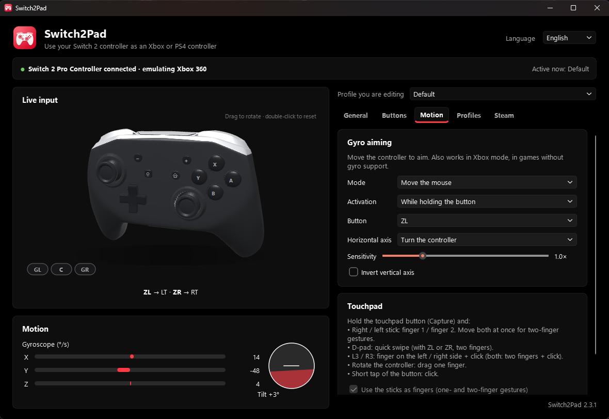
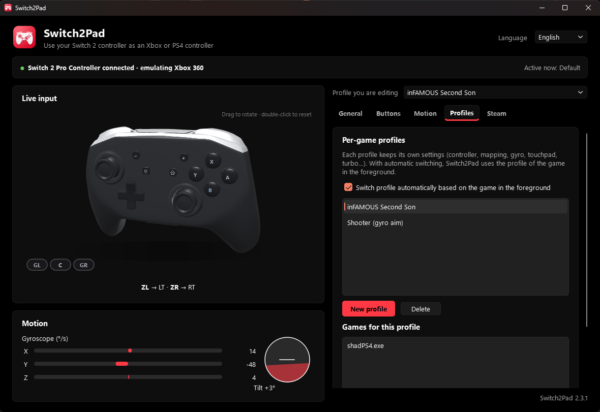

<div align="center">


# Switch2Pad

**Nintendo Switch 2 Pro コントローラーを PC で Xbox 360 / DualShock 4 コントローラーとして使えます。ジャイロ、タッチパッドジェスチャー、振動に対応。**

[](https://github.com/TomGGB/Switch2Pad/releases/latest)
[](https://github.com/TomGGB/Switch2Pad/releases)


[English](../README.md) · [Español](README.es.md) · [Português](README.pt-BR.md) · [Français](README.fr.md) · [Deutsch](README.de.md) · [Italiano](README.it.md) · **日本語** · [简体中文](README.zh-CN.md)


</div>

## Switch2Pad とは？

Windows やほとんどのゲームは USB 接続の Switch 2 Pro コントローラーを認識できません。特別な初期化シーケンスを受け取るまで入力すら送信しないためです。Switch2Pad はコントローラーと直接通信し、あらゆるゲーム・エミュレーター・ランチャーが対応している**仮想 Xbox 360 / DualShock 4** に変換します。

- 🎮 **Xbox 360 / PS4 モード**：プレイ中でもいつでも切り替え可能。
- 🌀 **ジャイロと加速度センサー**（PS4 モード）：DS4 のモーションに対応したゲームやエミュレーターでジャイロ操作。
- ✌️ **2本指にも対応したタッチパッドジェスチャー**：キャプチャーボタンを押している間、スティックが指になります。十字ボタンでスワイプ、L3/R3 で左右をクリック。
- 🎯 **どのゲームでもジャイロエイム**：Xbox モードでも、コントローラーを動かしてマウスや右スティックを操作。
- 🗂️ **ゲーム別プロファイル**：前面のゲームに合わせて自動で切り替え。
- ⌨️ **C ボタンのショートカット**、ボタンごとの**連射**、**振動の強さ**、スティックの**反応カーブ**。
- 📳 ゲームからコントローラーへの**振動**。
- 🧊 本物のコントローラーのジャイロに合わせて動き、押したボタンが光る **3D コントローラー表示**。
- 🚫 **Steam より優先**：ワンクリックで Steam によるコントローラーの横取りや割り当て変更を防止。
- 🔧 **全ボタンの割り当て変更**、A/B/X/Y の配置方式、スティックのデッドゾーン。
- 🪟 **Windows 11 ネイティブのデザイン**（Mica、ライト/ダーク、アクセントカラー）、システムトレイ、Windows と同時に起動。
- 🌍 **7 言語**、🐧 **Windows と Linux** に対応。

## ダウンロード

| プラットフォーム | ファイル | 備考 |
|---|---|---|
| **Windows 10/11** | [`Switch2Pad.exe`](https://github.com/TomGGB/Switch2Pad/releases/latest) | インストール不要。[ViGEmBus](https://github.com/nefarius/ViGEmBus/releases) がない場合はアプリがインストールを案内します。 |
| **Linux x86_64** | [`Switch2Pad-<version>-linux-x86_64.tar.gz`](https://github.com/TomGGB/Switch2Pad/releases/latest) | 展開して `./install.sh` を実行（メニュー項目と udev ルールを追加）。 |

## クイックスタート

1. Switch 2 Pro コントローラーを **USB-C ケーブル**で接続します。
2. Switch2Pad を開き、**Xbox 360** か **PS4 · DualShock 4** を選びます。
3. プレイ開始。ウィンドウを閉じてもシステムトレイで動作し続けます。

> **Steam を使っていますか？** *Steam* タブで **Switch2Pad を優先する** をクリックすると、Steam がコントローラーを横取りしなくなります（Steam は自動で再起動し、設定のバックアップが保存されます）。

## スクリーンショット

| タッチパッドジェスチャーとバックグラウンド | ボタンの割り当て |
|---|---|
|  |  |
| **Steam より優先** | **ライトテーマ · Xbox モード** |
|  |  |
| 🎯 | 🗂️ |
|  |  |
| **日本語 UI** | **システムトレイ** |
|  |  |

## タッチパッドジェスチャー（PS4 モード）

タッチパッドに割り当てたボタン（初期設定は**キャプチャー**）を押したまま:

| 入力 | タッチパッドの動作 |
|---|---|
| 右 / 左スティック | 指1 / 指2。両方動かすと **2本指ジェスチャー**（例：*inFAMOUS Second Son* の「MOVE CAR」） |
| 十字ボタン | その方向にすばやくスワイプ（ZL か ZR を押すと2本指） |
| L3 / R3 | 左 / 右側に指を置いて**クリック**（両方で2本指クリック） |
| コントローラーを傾ける | ジャイロで指を1本ドラッグ（オプション） |
| ボタンを短く押す | クリック |

タッチパッドボタンを押している間、スティックと十字ボタンはゲームに送られません。

## よくある質問

<details><summary><b>Bluetooth で使えますか？</b></summary>
現在は USB のみです。
</details>

<details><summary><b>Xbox と PS4、どちらのモードを使うべき？</b></summary>
Xbox 360 はほぼすべての PC ゲームで使えます。ジャイロやタッチパッドが必要なら PS4 を（shadPS4 などの PS4 エミュレーター、DS4 対応ゲーム、Steam）。
</details>

<details><summary><b>ゲームがコントローラーを2台認識します。</b></summary>
<a href="https://github.com/nefarius/HidHide">HidHide</a> で物理コントローラーを隠すか、2台目が Steam Input 由来なら <i>Steam より優先</i> を有効にしてください。
</details>

<details><summary><b>管理者権限は必要ですか？</b></summary>
通常ユーザーで動作します。ViGEmBus（Windows）や udev ルール（Linux）のインストール時に一度だけ求められます。
</details>

<details><summary><b>対応コントローラーは？</b></summary>
Switch 2 Pro コントローラー（動作確認済み）。NSO ゲームキューブコントローラー：実験的。Joy-Con 2：未対応。
</details>

## ソースからビルド

```sh
pip install -r requirements.txt pyinstaller
python -m PyInstaller switch2pad.spec      # Windows -> dist/Switch2Pad.exe
sh build_linux.sh                           # Linux   -> dist/Switch2Pad-<version>-linux-x86_64.tar.gz
```

## コントリビュート

Issue、アイデア、翻訳、プルリクエストを歓迎します。[CONTRIBUTING.md](../CONTRIBUTING.md) をご覧ください。Switch2Pad が役に立ったら、**⭐ を付けると他の人が見つけやすくなります。**

ライセンス：[MIT](../LICENSE) © Tomás González。コントローラーの 3D モデルは作者によるものです。

---

<sub>Switch2Pad は独立したプロジェクトであり、任天堂、ソニー、マイクロソフト、Valve とは無関係です。Nintendo Switch、DualShock、Xbox、Steam は各社の商標です。</sub>
